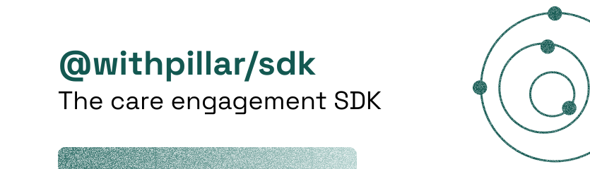

<br />
<br />


[](https://workos.semaphoreci.com/projects/workos-python)

Build quality care experiences fast with the official Pillar SDK.

## Installation

To install from npm, run the following:

```
npm i @pillar/sdk
```

### UMD Build

It is possible to use the Pillar Core SDK without any bundler.
Head over to the release page to download our UMD build.

In that case, you will need to include the script tag in your webpage.

## Embed SDK

The embed SDK allows our partner to embed ready to use widgets and user flows in 3 lines of codes.

Widgets will be rendered as "chromeless" iframes that can be integrated in any web or mobile page.

### PREREQUISITES

If you use Content-Security-Policy Headers, make sure that:

- `frame-src` allows for `platform.withpillar.com`
- `script-src` allows for you vendored version of the js sdk. Using a nonce is recommended

```html
<script src="/path/to/sdk.vX.XX.js" nonce="a-random-string" />
```

### Authentication

The package will need to be configured with your [public key] and your tenant URL.

By default your tenant URL will be https://platform.withpillar.com

Example

```js
import { PillarSDK } from "@pillar/core";

PillarSDK.init({
  publicKey: process.env.PUBLIC_KEY,
  tenantURL: "https://platform.withpillar.com",
});
```

## SDK Versioning

All of our SDKS follows a Semantic Versioning ([SemVer](https://semver.org/)) process where all releases will have a version X.Y.Z (like 1.0.0) pattern wherein Z would be a bug fix (e.g., 1.0.1), Y would be a minor release (1.1.0) and X would be a major release (2.0.0). We permit any breaking changes to only be released in major versions and strongly recommend reading changelogs before making any major version upgrades.

## More Information

Contact your account manager for any questions!
